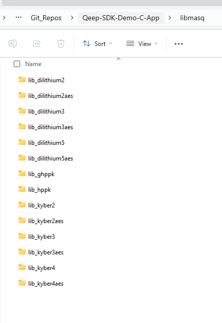
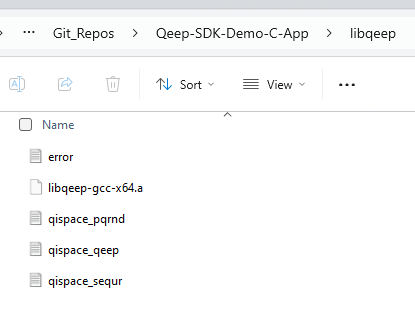

# Qeep-SDK-Demo-C-App

A functionality demo based in C++ to demonstrate the usage of the QEEP, SEQUR, PQRND and MASQ APIs as well as QiSpace RESTful API. For the best running experience, run the demo on an Ubuntu computer.

## **Overview:**
- **SEQUR**: Demonstrates the use of **SEQUR API to decode arbitrary QiSpace Enterprise payloads** using either a pre-loaded or QiSpace-REST-API-retrieved subscriber key (subkey).
- **QEEP**: Demonstrates use of **QEEP API for encryption/decryption** and, if desired, the process of retrieving a Quantum Key (QK) from QiSpace Enterprise. 
- **PQRND**: Demonstrates use of **PQRND API for generating Pseudo Quantum Random Data** with either pre-loaded Quantum Entropy (QE) or QiSpace-REST-API-retrieved QE.
- **MASQ**: Provides **Asymmetric Encryption** functionality. The two main functions of MASQ are **Key Exchange and Digital Signature** using a pair of public and private keys.

## **Installation and Preparation:**
1. Download or checkout this git repository.
2. Place the `libmasq`, `libqeep` folders containing MASQ and QEEP libraries for your OS under this repository's `(/c/demos)` folder.
    - `libmasq`: should contain all the contents from `ds` and `kem` from QiSpace MASQ SDK .`ds` and `kem` contain the needed Big Number libraries.
    - `libqeep`: should contain contents from `lib` folder under QiSpace QEEP SDK.

    The `libmasq` folder will look like below:
  
    

    The `libqeep` folder will look like below:
  
    

3. Copy the `qispace_info.h` file which contains the QiSpace API URL and Access token into `/src` directory.
    - Note: If the above-mentioned library folders and `qispace_info.h` are not available to you, please contact Quantropi Support team.
4. Run `make install_depends` to install required libraries 
    - nlohmann json
    - libcurl


## **Getting started:**
### Offline Mode (Dry-run): 
  - Run `make [sequr, qeep, pqrnd, masq_kem, masq_ds]` (e.g. `make qeep`)

### Online Mode: (QiSpace interaction is needed in this mode)
  - Run `make [sequr, seep, pqrnd] QISPACE_API_ON=1` (e.g. `make pqrnd QISPACE_API_ON=1`)

> Note: To Run the Online mode demo QiSpace SEQUR SDK is needed. Contact Quantropi to obtain if you do not have one.

Consider running the makefile commands individually if an error occurs.

Note: After a demo finishes, consider running `make clean` for consistent demo execution. 

*For more information, please refer the Makefile for detail*

## **Core Functionalities of this Demo:**
### SEQUR  `demo_sequr`: 
- Setup, configure and cleanup the SEQUR API
- Make HTTP request to establish subkey using QiSpace REST API
- Demonstrate subkey unpacking
- Decode the existing QiSpace payload

### QEEP `demo_qeep`:
- Setup, configure and cleanup the QEEP API
- Make HTTP request to QiSpace REST API for Quantum Key retrieval  
- Demonstrate QK unpacking
- Encrypt & decrypt with QEEP API properly

### PQRND Demo `demo_pqrnd`:
- Setup, configure and cleanup the PQRND API
- Obtain Quantum Entropy from QiSpace REST API 
- Generate PQRND with the available data

### MASQ KEM Demo `demo_masq_kem`:
- Initialize MASQ using one of:

  1) QiSpace NGen random callback functions from QiSpace QEEP SDK, or
  2) User-provided random callback functions

- Generate Keypair using the MASQ KEM API
- Encrypt & Decrypt the message using MASQ KEM APIs

Test the below supported Key-Exchange algorithms:

`ALG = hppk kyber2 kyber3 kyber4 kyber2aes kyber3aes kyber4aes`

The supported Big Number libraries are `BN = qtp gmp`

> Note: Kyber library does not depend on any Big Number library. 

The Defaults used for the demo are `ALG=hppk` for NIST Security level 3, using `BN=qtp` and QiSpace NGen as the Initialization API to generate random numbers.

```
make masq_kem
```

To test other specific algorithms, run
```
make masq_kem ALG=<ALG> BN=<BN>
```

### MASQ DS Demo `demo_masq_ds`:
- Initialize MASQ using one of:

  1) QiSpace NGen random callback functions from QiSpace QEEP SDK, or 
  2) User-provided random callback functions

- Generate Keypair to sign the message
- Sign the message
- Verify the message and signature using MASQ DS API

Test the below supported Digital Signature algorithms:

`ALG = ghppk hppk dilithium2 dilithium3 dilithium5 dilithium2aes dilithium3aes dilithium5aes`

The supported Big Number libraries are `BN = qtp gmp`

> Note: Dilithium library does not depend on any Big Number library.

The Defaults used for the demo are `ALG=ghppk` for NIST Security level 5, using `BN=qtp` and QiSpace NGen as the Initialization API to generate random numbers.

```
make masq_ds
```

To test other specific algorithms, run
```
make masq_ds ALG=<ALG> BN=<BN>
```

## **License:** 
See the [LICENSE](LICENSE) file. Copyright © Quantropi, Inc 
 
For more general information about SEQUR, QEEP, PQRND and MASQ APIs as well as QiSpace REST API, see Quantropi documentation site.
