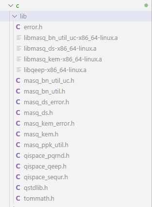

# QiSpace-SDK-Demo-C-App

A functionality demo based in C/C++ to demonstrate the usage of the SEQUR, QEEP and PQRND APIs, MASQ APIs as well as QiSpace RESTful API. For best running experience, run the demo on an Ubuntu computer.

## **Overview**
- #### SEQUR: Demonstrates the use of SEQUR API to decode arbitrary QiSpace Enterprise payloads using either a pre-loaded or QiSpace-REST-API-retrieved subscriber key (subkey).
- #### QEEP: Demonstrates the use of QEEP API for encryption/decryption and, if desired, the process of retrieving a Quantum Key (QK) from QiSpace Enterprise. 
- #### PQRND: Demonstrates the use of PQRND API for generating Pseudo Quantum RaNdom Data with either pre-loaded Quantum Entropy (QE) or QiSpace-REST-API-retrieved QE.
- #### MASQ: Provides Asymmetric Encryption Functionality. The two main functions of MASQ are *Key Exchange* and *Digital Signature* using a pair of public and private keys.

## **Installation and Preparation**
1. Download this git repository to local machine
2. Get the QiSpace SDK from Quantropi. QiSpace SDK contains SEQUR, QEEP and MASQ libraries.
3. Unzip/Untar all the contents of the libraries in `lib` folder for your OS under this repository's folder (`/c`)
  
    The `lib` folder will have below files:
  
  

4. **[Optional]** Copy the `qispace_info.h` file which contains the QiSpace API URL and access token into `/src` directory (This is only required for "Online Mode", MASQ demos do not require this file).
  - Note: If the above mentioned `lib` folder and `qispace_info.h` are not available to you, please contact Quantropi Support team.
5. Run `make install_depends` to install required libraries 
  - nlohmann json
  - libcurl

  If an error occurs, consider running the makefile commands individually.

## **Getting Started**
### Offline Mode (Dry-run) 
  - Run "make [sequr, qeep, pqrnd, masq_kem, masq_ds]" (i.e `make qeep`)

### Online Mode (QiSpace interaction is needed in this mode)
  - Run "make [sequr, qeep, pqrnd] QISPACE_API_ON=1" (i.e `make pqrnd QISPACE_API_ON=1`)

Note: After a demo finishes, consider running `make clean` for consistent demo execution. 

*For more information, please refer MAKEFILE*

## **Core Functionalities**
### SEQUR  `demo_sequr`: 
- Setup, configure, and cleanup  SEQUR API
- Make HTTP request to establish subkey using QiSpace REST API
- Demonstrate subkey unpacking
- Decode  existing QiSpace payload

### QEEP `demo_qeep`:
- Setup, configure and cleanup  QEEP API
- Make HTTP request to QiSpace REST API for Quantum Key retrieval  
- Demonstrate QK unpacking
- Encrypt & decrypt with QEEP API

### PQRND Demo `demo_pqrnd`:
- Setup, configure and cleanup the PQRND API
- Obtain Quantum Entropy from QiSpace REST API 
- Generate PQRND with the available data

### MASQ KEM Demo `demo_masq_kem`:
- Generate Keypair using the MASQ KEM API
- Encapsulation & Decapsulation of Shared Secert using MASQ KEM APIs

### MASQ DS Demo `demo_masq_ds`:
- Generate Keypair to sign the message
- Sign the message
- Verify the message and signature using MASQ DS API
 
## **License** 
See [LICENSE](LICENSE). Copyright © Quantropi, Inc 
 
Refer to documentation site for more general information about SEQUR, QEEP and PQRND APIs, MASQ APIs as well as QiSpace REST API.
